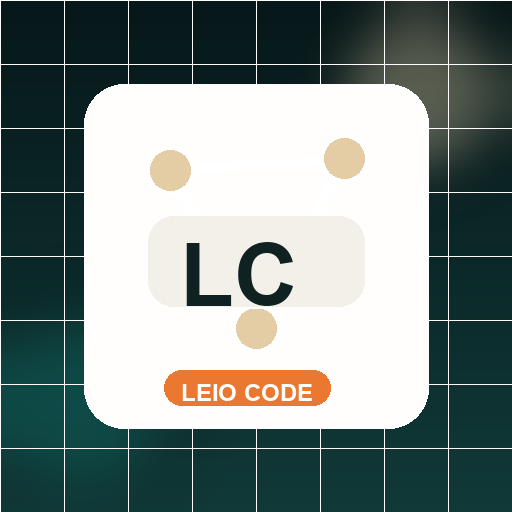
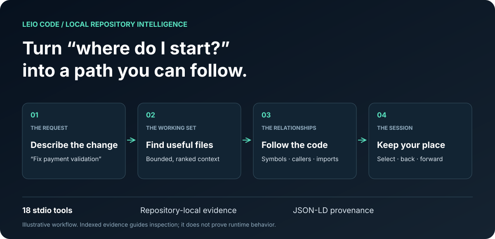
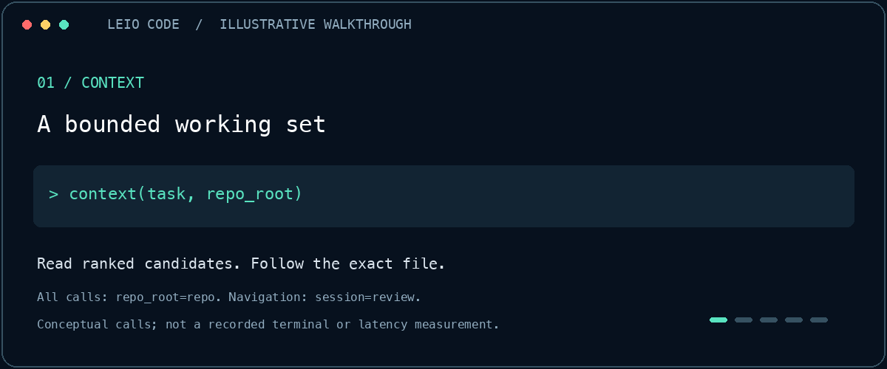

<p align="center"></p>

<h1 align="center">LEIO Code — Give your coding agent a map.</h1>

<p align="center">Find the right files. Follow the calls. Pick up where you left off.</p>

<p align="center"><a href="https://leio.getjai.com/">See LEIO in action</a> · <a href="docs/install-stdio.md">Install with one prompt</a> · <a href="docs/BENCHMARKS.md">Read the benchmarks</a></p>



**LEIO Code gives your local coding agent repository context it can act on.**
A Rust CLI and **18-tool stdio MCP** turn a task into a ranked working set,
expose indexed callers and imports, and keep a session cursor as the agent
explores. Each repository keeps its own index and JSON-LD evidence trail.

**Local stdio · Stateful navigation · Open source: MIT OR Apache-2.0**

## Less searching. More understanding.

| When your agent needs to… | LEIO gives it… |
| --- | --- |
| Get oriented in an unfamiliar repository | A bounded context bundle with ranked files and follow-up calls |
| Check what a change might affect | Indexed callers, callees, imports and concrete callsites |
| Explore without losing its place | Named sessions, a cursor, selection, back and forward |
| Leave inspectable evidence | Repository-local artifacts and JSON-LD provenance events |

Code indexing and navigation run locally. Optional configured services have their
own network behavior. Retrieval is a starting point for inspection; indexed
relationships do not prove runtime behavior or complete call coverage.

## Watch the workflow



*Illustrative walkthrough, not a recorded terminal or a timing measurement.*
[Static, motion-free walkthrough](docs/product-tour.md) · [Interactive site](https://leio.getjai.com/)

## Built for the investigation—not just the lookup.


Three real code paths. **11 MCP tool calls per run.** Find context, inventory
symbols, follow a callee, return to the starting symbol, restart the provider,
and confirm the session cursor is still there.

| Guided investigation | Median full sequence |
| --- | ---: |
| Trace context ranking | **1.49 s** |
| Follow workflow policy dispatch | **1.46 s** |
| Investigate MCP binary selection | **1.42 s** |

**15 of 15 scripted runs passed**, including cursor restoration after provider
restart. Measured on this repository's **420 indexed files**, Apple M1,
release 2.6.2. The current release is 2.6.5; these timings were not re-run.
Five runs per scenario; warm index/graph. Timings include the
11 calls, checks and reconnect; setup is excluded.

These are guided navigation benchmarks with labeled targets, not autonomous
bug fixes or an agent productivity comparison. Every sample, including the
slowest 1.71 s run, is published with the methodology.

**[See the complete benchmark and reproduce it →](docs/BENCHMARKS.md)**

## Install with one prompt

Paste this into a local coding agent with terminal access:

> Install the official LEIO Code local stdio MCP from https://github.com/josaum/leio-code by following docs/install-stdio.md. Inspect the installation script, check prerequisites, build the locked source, and verify the actual MCP handshake, 18 tools, context and session navigation. Register only the leio-code stdio server in this host, preserving other MCP entries. Use absolute paths and the installer output. Do not enable the HTTP integration. Tell me whether a host reconnect is required and report the installed revision and verification results.

Or install from source yourself:

```bash
git clone https://github.com/josaum/leio-code.git ~/.local/share/leio-code/source
cd ~/.local/share/leio-code/source
bash scripts/install-stdio.sh
```

Requires **Git, a C/C++ toolchain, stable Rust, Node.js 22+ and npm**. Compilation
can take several minutes. The installer verifies the real stdio connection and
prints MCP configuration. Register it in your host and reconnect; keep the
checkout. No hosted HTTP service or SSH key is required. This is a source
installation; prebuilt binaries and npm publication are not claimed.

[Complete setup and updates](docs/install-stdio.md) · [Source release 2.6.5](https://github.com/josaum/leio-code/releases/tag/leio-code-plugin-v2.6.5)

## Your first useful query

```bash
leio-code --repo /absolute/path/to/repo init
leio-code --repo /absolute/path/to/repo context "fix the payment validation flow"
```

Read the returned files, inspect exact symbols with `graph symbols-in`, then use
the returned symbol identity to navigate. Pin the repository and an explicit
session when multiple agents work in the same tree.

## Go deeper

| Guide | Start here for… |
| --- | --- |
| [Product tour](docs/product-tour.md) | Context → graph → navigation, step by step |
| [Technical guide](docs/CLI-GUIDE.md) | CLI commands, storage, knowledge, profiles and development |
| [Agent skill](skills/leio-code/SKILL.md) | The canonical tool-routing contract |
| [Context bundles](docs/CONTEXT_BUNDLE.md) | Ranking and retrieval limits |
| [Benchmarks](docs/BENCHMARKS.md) | Public measurements and reproducibility |
| [Conversation evidence](docs/conversation-workflow.md) | Working with explicitly selected conversation files |
| [Optional HTTP integration](apps-sdk/README.md) | Hosted adapter setup and its separate capabilities |
| [Contributing](CONTRIBUTING.md) | A focused change, a clear check, and a reviewable PR |

## Built to inspect

First-party source is licensed under **[MIT OR Apache-2.0](LICENSE)**, at your
option. Dependencies retain their own licenses; see [third-party notices](THIRD_PARTY.md).
The [public source policy](docs/PUBLIC-SOURCE.md) describes the distribution.
