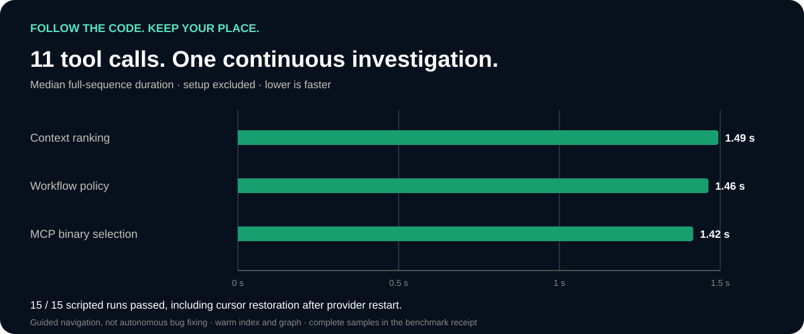
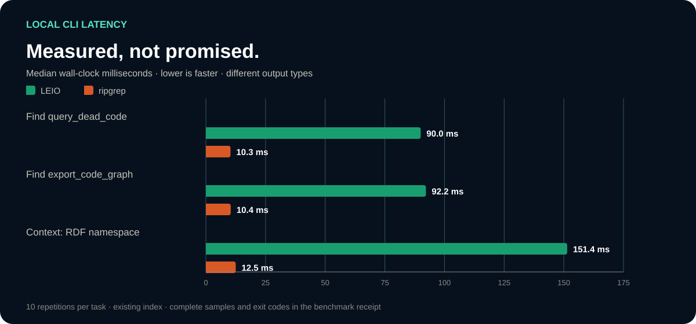

# Measured, with the receipts

LEIO adds ranked context, structural queries and a navigation session to your
agent's workflow. These local measurements show what that costs and how well
retrieval performs on the checked-in development tasks.

Measured **9 September 2026**, Apple M1, macOS 26.5.2, release binary
`2.6.2 (a21963badc83, clean)`, against source revision
[`a21963b`](https://github.com/josaum/leio-code/tree/a21963badc83bc149a42ebfa192820ee384398fb).
[Machine-readable results](../benchmarks/public-results.json).

## Multi-step investigations through stdio MCP

The primary product benchmark exercises three guided investigations in the real
public repository: **414 indexed files**, source `a21963badc83`, Node.js 24.13.0.
It runs actual MCP calls against the release CLI, with default provenance events
enabled. The index and graph are prepared before timing starts.



| Scenario | Full-sequence median | Scripted checks passed |
| --- | ---: | ---: |
| Trace context ranking | 1,486.4 ms | 5 / 5 |
| Follow workflow policy dispatch | 1,560.4 ms | 5 / 5 |
| Investigate MCP binary selection | 1,901.5 ms | 5 / 5 |

Each sequence uses **11 tool calls**:

1. `context` returns at most five files and includes the labeled implementation.
2. `graph symbols-in` supplies the caller's exact stable identity.
3. `nav goto` sets the cursor, then `here` records it.
4. `nav callees` lists results; another `here` checks that listing did not move it.
5. `nav select` chooses the labeled callee; `here` checks the selected symbol.
6. `nav back` returns; `here` checks the restored cursor.
7. Close and reconnect the MCP provider; `here` verifies persisted position.

The measured interval includes all calls, assertions, and one provider
close/reconnect. Initial index creation, graph warm-up and initial connection
are excluded. All 15 runs passed these assertions. Times vary: the binary-selection
scenario included a **7,958.2 ms** run; its median is 1,901.5 ms.

These are **guided development scenarios**, chosen to exercise a known path.
The script receives the expected file and edge; it does not independently
reason about a bug. Only the selected relationship is checked. Other candidates,
call-edge completeness and architectural correctness are not validated. There
is no comparison arm, token-saving estimate or end-to-end productivity claim.

[Every timed run and assertion result](../benchmarks/navigation-results.json) ·
[Runnable benchmark](../scripts/benchmark_navigation.mjs)

### Reproduce the guided benchmark

Run the current benchmark script against a separate checkout of the measured
source. Build that checkout's binary so source identity is explicit:

```bash
git worktree add --detach /tmp/leio-benchmark-source a21963badc83bc149a42ebfa192820ee384398fb
(cd /tmp/leio-benchmark-source && cargo build --locked --release -p leio-code)
npm ci --prefix mcp
LEIO_CODE_BIN=/tmp/leio-benchmark-source/target/release/leio-code \
  node scripts/benchmark_navigation.mjs --repo /tmp/leio-benchmark-source \
  --repeats 5 --output /tmp/navigation-results.json
```

The script rebuilds the target index and creates named navigation sessions there.
It makes no LLM calls. Use a disposable checkout, and keep the JSON output for
comparison. A failing assertion stops the run instead of reporting success.

## Additional query and retrieval measurements

The following small-query benchmarks are separate from the multi-step study.



## Query latency

Median elapsed wall time, **10 CLI subprocess invocations per task**, existing
index. Includes process startup and output production; it is not MCP transport
latency. These are warm local runs, not cold-index measurements.

| Task | LEIO | ripgrep textual lookup |
| --- | ---: | ---: |
| Find `query_dead_code` | 103.9 ms | 11.5 ms |
| Find `export_code_graph` | 92.7 ms | 10.7 ms |
| Context for RDF namespace configuration | 117.0 ms | 12.1 ms |

All invocations returned exit code 0. ripgrep is faster for these literal searches.
The outputs are different: textual matches versus LEIO's indexed symbol/context
results. This comparison does not establish equal relevance, an agent speedup,
token savings, or time to a correct answer. Machine load and cache state affect
results. The existing script's ratio is `rg_ms / leio_ms`, not a product speedup.

## Retrieval quality

Seven pre-existing, labeled tasks; each asks for at most five context files.
Expected files are development labels, not exhaustive relevance judgments.

| Measure | Result |
| --- | ---: |
| Expected file in first position | 2 / 7 |
| Expected file in top three | 4 / 7 |
| Mean reciprocal rank | 0.493 |

Every task and returned path is included in the JSON report, including misses.
The suite is small and used during development, not held out. This does not
measure architecture correctness, call-edge completeness, code quality, or
application runtime behavior. No before/after or competitor quality claim is made.

## Reproduce

From a clean checkout of the measured revision, build the release binary and
create its index. Use an absolute binary path; `--version` should identify the
revision you intend to measure. Run the two scripts sequentially:

```bash
cargo build --locked --release -p leio-code
./target/release/leio-code --repo . index
python3 scripts/benchmark_retrieval.py --binary "$PWD/target/release/leio-code" --repeats 10
python3 scripts/evaluate_retrieval.py --binary "$PWD/target/release/leio-code" \
  --repo . --tasks benchmarks/retrieval-agent-tasks.json --output /tmp/retrieval.json
```

Timing tasks: [benchmark_retrieval.py](../scripts/benchmark_retrieval.py).
Relevance labels: [retrieval-agent-tasks.json](../benchmarks/retrieval-agent-tasks.json).
The scripts make no LLM calls. Results will vary across revisions and machines.
