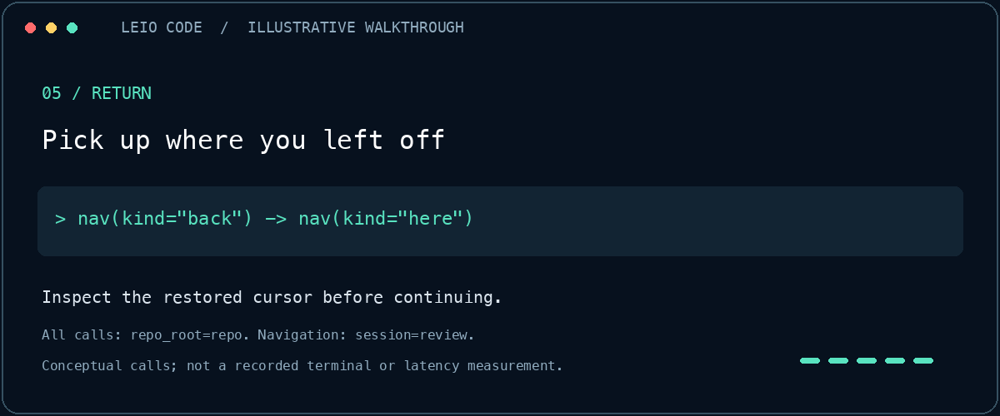

# From a task to a useful next step

This is an illustrative workflow, not a recorded query or a performance result.

1. **Describe the task.** `context` returns a bounded list of ranked files and
   suggested next calls. Read candidates before treating them as evidence.
2. **Inspect the exact file.** `graph symbols-in` inventories its declarations.
   Copy the intended symbol identity from the result; do not guess a URN.
3. **Set your place.** `nav goto` selects that symbol in an explicit session.
4. **Follow a relationship.** `nav callees` lists candidate results. The cursor
   stays in place until `nav select` chooses a zero-based result index.
5. **Return with context.** `nav back` restores the previous cursor. `nav here`
   lets the agent check where it is before continuing.

Every tool call uses the same absolute repository root. Every navigation call
uses the same explicit session. Each concurrent agent uses a different session.
Graph relationships reflect indexed evidence, not verified runtime behavior.

[Install](install-stdio.md) · [Exact tool contract](../skills/leio-code/SKILL.md)

## Final navigation frame

